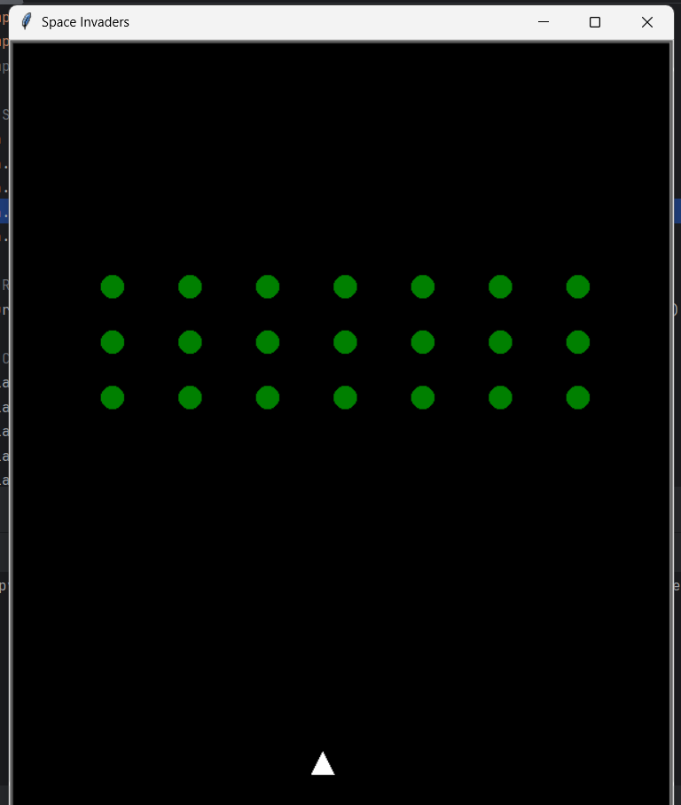

# Space Invaders (Python Turtle)

A simple recreation of the classic Space Invaders game using Python Turtle.

## 🎮 Demo



## Features
- Player ship that moves and shoots
- Multiple rows of alien invaders
- Bullet collision detection
- Victory and Game Over messages

## Controls
- ← Move Left
- → Move Right
- Spacebar to Shoot

## Run
```bash
python main.py
